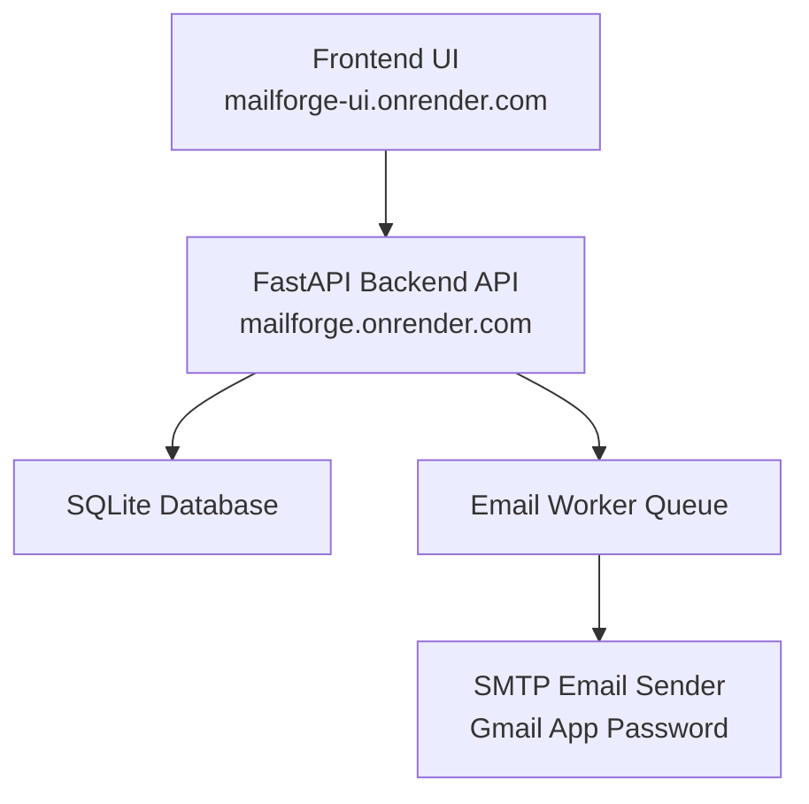

# 🚀 MailForge — Automated HR Outreach Platform

MailForge is a full-stack automation tool designed to solve a real problem faced by job seekers: **sending personalized cold emails to hundreds or thousands of HR contacts efficiently**.

Instead of manually copying emails from a PDF and sending messages one-by-one, MailForge automates the entire outreach workflow.

Users can upload a directory of HR emails, create campaigns, attach their resume, and automatically send personalized emails while respecting Gmail safety limits.

---

# 🌍 Live Demo

Frontend (UI)  
https://mailforge-ui.onrender.com

Backend API  
https://mailforge.onrender.com/docs

---

# 🧠 The Real Problem

While searching for jobs, I obtained a **PDF directory containing around 1800 HR contacts** with details such as:

- HR Name
- Email Address
- Title
- Company

Sending cold emails manually required:

1. Opening the PDF
2. Copying the email
3. Opening Gmail
4. Writing or pasting the message
5. Attaching resume
6. Personalizing the email
7. Sending it

Repeating this **1800 times** would take **days of manual work**.

So I asked myself:

> “Why not build a system that automates this entire process?”

That idea led to the creation of **MailForge**.

---

# 💡 Solution

MailForge automates the entire cold-outreach process.

Users simply:

1️⃣ Upload a PDF containing HR contacts  
2️⃣ Create a campaign  
3️⃣ Upload their resume  
4️⃣ Write an email template  
5️⃣ Start the campaign

The system automatically:

- Extracts contacts from the PDF
- Validates email addresses
- Stores campaign data
- Sends emails one-by-one safely
- Tracks progress in real time

---

# ✨ Key Features

### 📄 PDF Contact Extraction
Extracts structured contact data from HR directories.

### 📧 Automated Email Campaigns
Send hundreds of cold emails automatically.

### 📎 Resume Attachment
Automatically attaches the user’s resume to each email.

### ⏱ Gmail Safety Limits
Implements delays and daily limits to avoid Gmail spam detection.

### 📊 Campaign Dashboard
Track:

- Total Emails
- Sent
- Pending
- Failed

### ⏸ Pause / Resume Campaign
Users can stop campaigns anytime.

### 📬 Personalized Email Templates
Users can write custom email messages.

### 🔍 Email Validation
Invalid emails are filtered automatically.

### 🌐 Fully Deployed SaaS
Accessible online via browser.

---

## 🏗 System Architecture


---

# 🛠 Tech Stack

## Backend

- Python
- FastAPI
- SQLAlchemy
- SQLite
- SMTP Email Integration
- Background Worker System

## Frontend

- HTML
- TailwindCSS
- JavaScript

## Deployment

- Render (Backend Web Service)
- Render (Static Frontend Hosting)

---

# 📁 Project Structure
```

MailForge
│
├── backend
│ ├── main.py
│ ├── models.py
│ ├── database.py
│ ├── email_sender.py
│ ├── pdf_parser.py
│ ├── validator.py
│ └── queue_worker.py
│
├── frontend
│ ├── index.html
│ ├── dashboard.html
│ ├── campaigns.html
│ └── assets
│ └── favicon.png
│
├── uploads
│
├── requirements.txt
│
└── start.sh
```
---

# ⚙️ How It Works

### Step 1 — Upload PDF
Users upload a PDF containing HR contact information.

### Step 2 — Extract Contacts
The system extracts structured contact data from the document.

### Step 3 — Create Campaign
Emails are stored inside a campaign.

### Step 4 — Email Processing
Background worker sends emails sequentially.

### Step 5 — Dashboard Updates
Campaign statistics update in real time.

---

# 🚀 Deployment

MailForge is deployed using **Render**.

### Backend Deployment
Runtime: Python
Build Command: pip install -r requirements.txt
Start Command: bash start.sh
### Frontend Deployment
Static Site
Root Directory: frontend
Publish Directory: .
---

# ⚠️ Challenges Faced During Development

Building MailForge involved solving multiple technical challenges:

### Parsing structured data from PDFs
Extracting tabular contact data reliably required experimenting with PDF parsing tools.

### Handling large email lists
Managing thousands of emails required a proper queue system.

### Gmail spam protection
To prevent Gmail from blocking the account, delays and rate limits were implemented.

### Background processing
Campaigns needed to run in the background while updating progress on the dashboard.

### Deployment complexity
Separating frontend and backend deployments required careful configuration.

---

# 📈 Future Improvements

Planned features include:

- Email open tracking
- Recruiter reply detection
- LinkedIn profile integration
- AI-generated personalized emails
- CSV contact uploads
- Multi-user authentication
- Email scheduling
- Campaign analytics dashboard

---

# 👨‍💻 Author

**Om Sonawane**

Aspiring AI Engineer & Software Developer passionate about building intelligent tools, automation systems, and scalable web applications.

📍 Pune, Maharashtra, India

📧 Email  
omsonawane.660@gmail.com

📱 Phone  
+91 9373156213

🔗 LinkedIn  
https://www.linkedin.com/in/om-sonawane360

💻 GitHub  
https://github.com/OmSonawane-360

---

# ⭐ If you found this project interesting

Consider giving the repository a **star** ⭐
